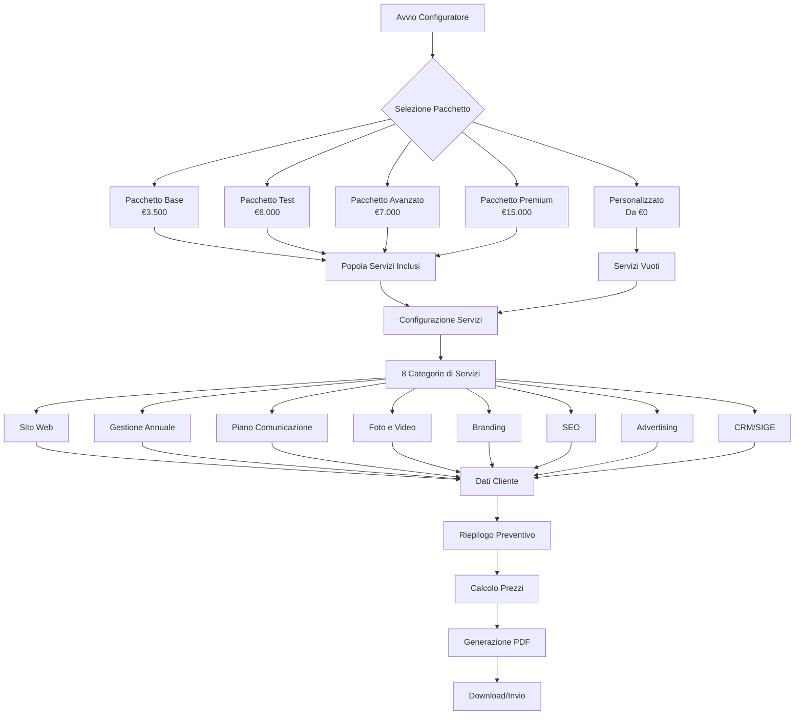
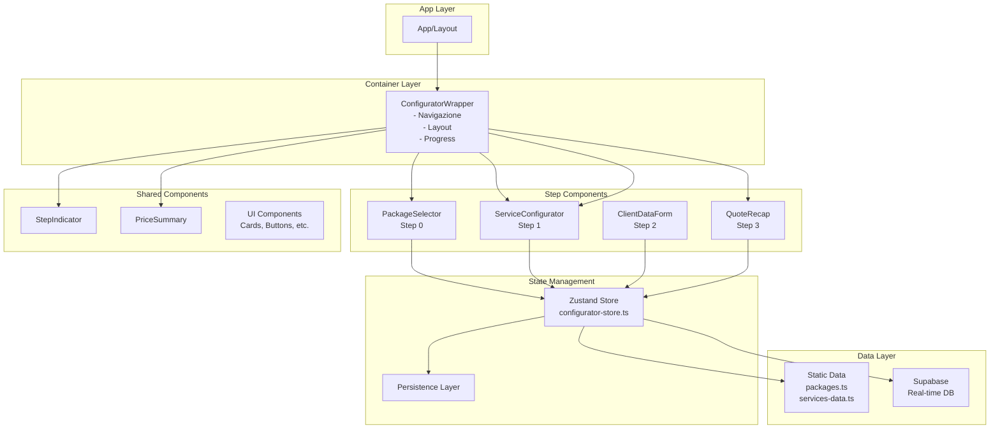
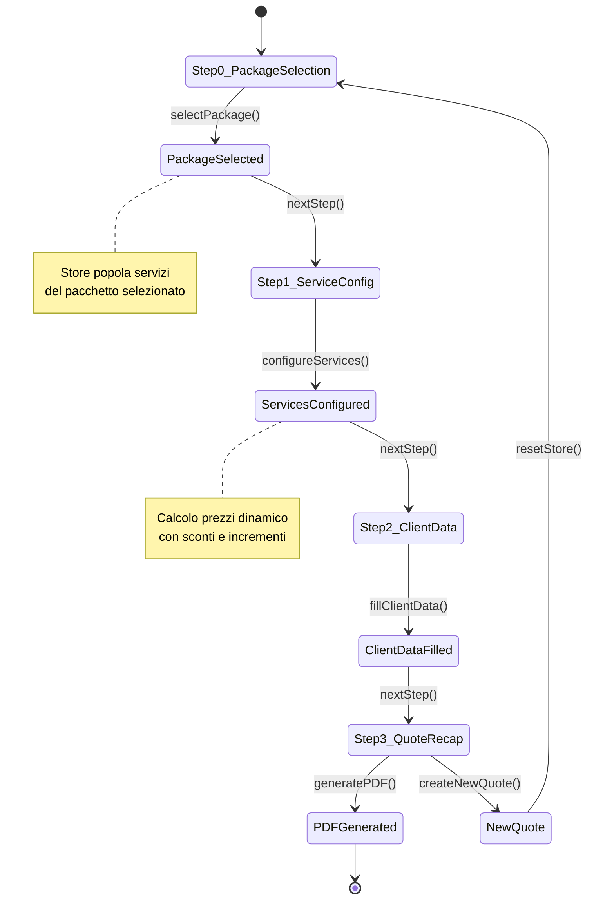
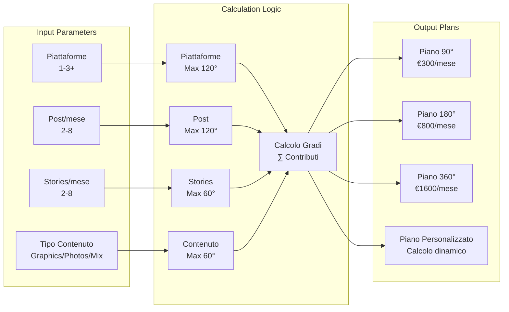
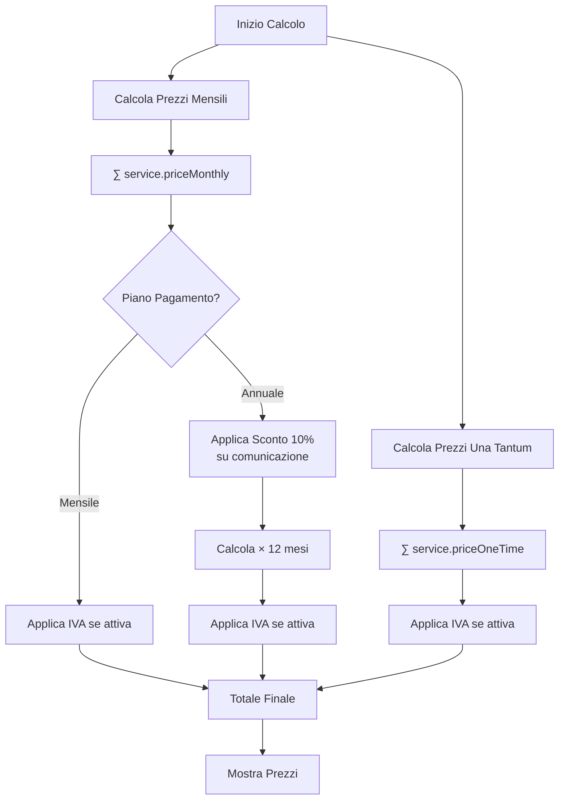
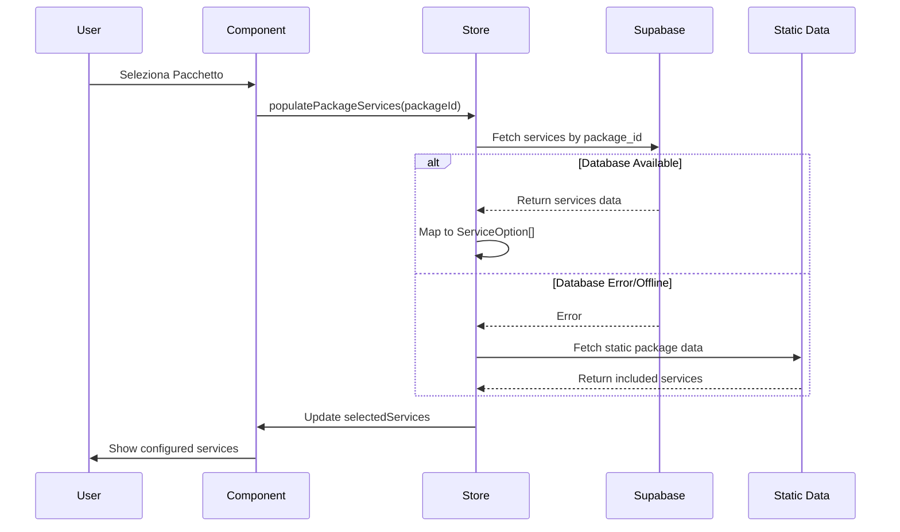
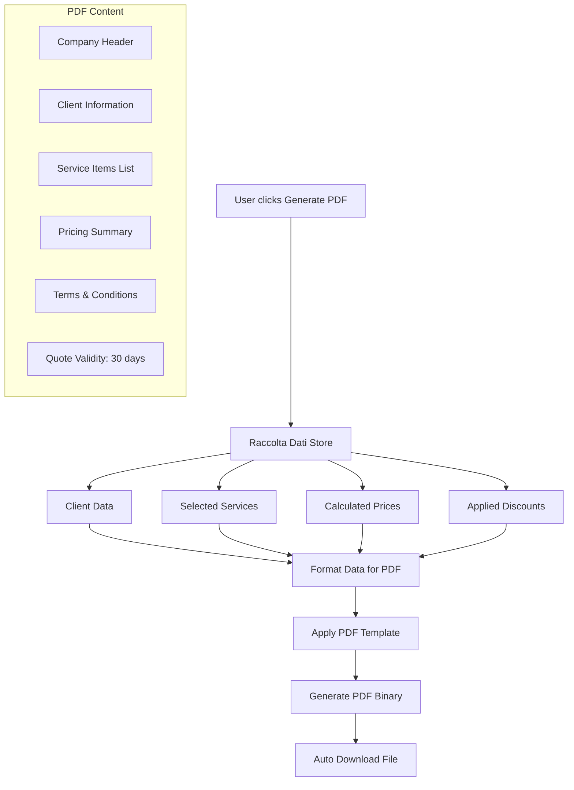

# Diagramma di Flusso del Configuratore

## Flusso Principale

## Architettura Componenti

## Gestione dello Stato

## Piano di Comunicazione - Sistema Gradi

## Calcolo Prezzi

## Integrazione Database

## Generazione PDF

---

*Questi diagrammi forniscono una rappresentazione visuale dei flussi e delle interazioni principali del configuratore preventivi.*