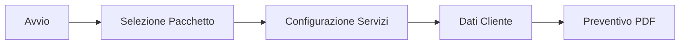

# Configuratore Preventivi - Righello Digital

[](https://vercel.com/wearerighello/v0-configuratorepreventivimain-e6)
[](https://v0.app/chat/projects/KGYv8y4anTV)
[](https://nextjs.org/)
[](https://www.typescriptlang.org/)
[](https://supabase.com/)

## 📋 Panoramica

Configuratore preventivi interattivo per servizi digitali completi. Un'applicazione multi-step wizard che guida gli utenti attraverso la selezione di pacchetti e servizi, la personalizzazione dei dettagli, e la generazione automatica di preventivi PDF professionali.

### 🎯 Caratteristiche Principali

- **Multi-step Wizard**: Flusso guidato in 4 step principali
- **Pacchetti Predefiniti**: Base, Test, Avanzato, Premium e Personalizzato
- **8 Categorie di Servizi**: Sito web, gestione, comunicazione, foto/video, branding, SEO, advertising, CRM
- **Sistema Gradi Unico**: Piano comunicazione con calcolo 90°-360°
- **Prezzi Dinamici**: Calcolo in tempo reale con sconti e incrementi
- **Generazione PDF**: Preventivi professionali automatici
- **Real-time Updates**: Sincronizzazione database live
- **Responsive Design**: Ottimizzato per tutti i dispositivi

## 🏗️ Architettura Tecnica

### Stack Tecnologico
- **Frontend**: Next.js 14 + React 18 + TypeScript
- **State Management**: Zustand con persistenza
- **Database**: Supabase (PostgreSQL)
- **UI Components**: Radix UI + Tailwind CSS
- **Animations**: Framer Motion  
- **PDF Generation**: React-PDF + jsPDF
- **Deployment**: Vercel

### Struttura Progetto
```
src/
├── components/
│   ├── configurator-wrapper.tsx     # Container principale
│   ├── steps/                       # Step del wizard
│   │   ├── package-selector.tsx     # Selezione pacchetto
│   │   ├── service-configurator.tsx # Configurazione servizi
│   │   ├── client-data-form.tsx     # Dati cliente
│   │   └── quote-recap.tsx          # Riepilogo preventivo
│   ├── ui/                          # Componenti UI riutilizzabili
│   └── ...
├── store/
│   └── configurator-store.ts        # Store Zustand centralizzato
├── data/
│   ├── packages.ts                  # Definizione pacchetti
│   └── services-data.ts             # Catalogo servizi
├── types/
│   └── index.ts                     # Definizioni TypeScript
└── utils/
    ├── pdf-generator-new.ts         # Generazione PDF
    └── ...
```

## 🚀 Quick Start

### Prerequisiti
- Node.js 18+ 
- pnpm (consigliato) o npm
- Account Supabase

### Installazione

1. **Clone del repository**
```bash
git clone https://github.com/axelfleureau/v0-configuratorepreventivimain.git
cd v0-configuratorepreventivimain
```

2. **Installazione dipendenze**
```bash
# Con pnpm (consigliato)
pnpm install --no-frozen-lockfile

# Con npm
npm install
```

3. **Configurazione ambiente**
```bash
cp .env.example .env.local
```

Configura le variabili in `.env.local`:
```env
NEXT_PUBLIC_SUPABASE_URL=your_supabase_url
NEXT_PUBLIC_SUPABASE_ANON_KEY=your_supabase_anon_key
```

4. **Avvio sviluppo**
```bash
pnpm dev
# o
npm run dev
```

L'applicazione sarà disponibile su `http://localhost:3000`

## 📚 Documentazione Completa

### 📖 Guide Principali

1. **[Struttura Logica Completa](./CONFIGURATOR_STRUCTURE.md)**
   - Panoramica sistema e architettura
   - Flusso di navigazione dettagliato
   - Gestione stato e persistenza
   - Sistema prezzi e calcoli

2. **[Diagrammi di Flusso](./FLOW_DIAGRAM.md)**
   - Flusso principale utente
   - Architettura componenti
   - Gestione stato e calcoli
   - Diagrammi Mermaid interattivi

3. **[Architettura Tecnica](./TECHNICAL_ARCHITECTURE.md)**
   - Design patterns implementati
   - Ottimizzazioni performance
   - Sicurezza e validazione
   - Testing strategy

4. **[Integrazione API](./API_INTEGRATION.md)**
   - Schema database Supabase
   - Real-time hooks
   - Generazione PDF
   - Error handling

### 🎯 Flusso Utente



## 🛠️ Funzionalità Avanzate

### Sistema Gradi Piano Comunicazione
Algoritmo proprietario per calcolare piani di comunicazione personalizzati:

- **90°**: 2 post + 2 stories, 1 piattaforma (€300/mese)
- **180°**: 4 post + 4 stories, 2 piattaforme (€800/mese)  
- **360°**: 8 post + 8 stories, 3+ piattaforme (€1600/mese)
- **Personalizzato**: Calcolo dinamico basato su parametri

### Calcolo Prezzi Dinamico
- Prezzi base (one-time vs mensili)
- Incrementi percentuali (es. drone +35%)
- Sconti condizionali (es. portfolio -50%)
- Sconto annuale 10% su comunicazione
- VAT opzionale (22%)

### Resilienza Sistema
- **Layer 1**: Database Supabase in tempo reale
- **Layer 2**: Fallback a dati statici
- **Layer 3**: Dati di emergenza hardcoded

## 🎨 Personalizzazione

### Aggiungere Nuovi Servizi
```typescript
// data/services-data.ts
{
  id: "nuovo-servizio",
  name: "Nome Servizio", 
  description: "Descrizione dettagliata",
  category: "website", // categoria esistente
  group: "funzionalita", // gruppo logico
  priceOneTime: 500, // prezzo una tantum
  priceMonthly: 50, // prezzo mensile
}
```

### Aggiungere Nuovi Pacchetti
```typescript
// data/packages.ts
{
  id: "nuovo-pacchetto",
  label: "Pacchetto Nuovo",
  description: "Descrizione del pacchetto",
  basePrice: 5000,
  includedServiceIds: ["servizio-1", "servizio-2"],
  borderColor: "#ff6b35"
}
```

## 🚀 Deployment

### Vercel (Raccomandato)
```bash
# Deploy automatico collegando repository GitHub
vercel --prod
```

### Build Manuale
```bash
pnpm build
pnpm start
```

### Variabili Ambiente Produzione
```env
NEXT_PUBLIC_SUPABASE_URL=
NEXT_PUBLIC_SUPABASE_ANON_KEY=
NODE_ENV=production
```

## 🧪 Testing

```bash
# Unit tests
pnpm test

# E2E tests
pnpm test:e2e

# Lint
pnpm lint

# Type check
pnpm type-check
```

## 🤝 Contribuire

1. Fork del repository
2. Crea branch feature (`git checkout -b feature/AmazingFeature`)
3. Commit changes (`git commit -m 'Add AmazingFeature'`)
4. Push branch (`git push origin feature/AmazingFeature`)
5. Apri Pull Request

### Standard Codice
- TypeScript strict mode
- ESLint + Prettier
- Commit convenzionali
- Test coverage > 80%

## 📝 Changelog

### v1.0.0 (Corrente)
- ✅ Configuratore multi-step completo
- ✅ Sistema gradi piano comunicazione
- ✅ Integrazione Supabase real-time
- ✅ Generazione PDF automatica
- ✅ Responsive design completo

### Roadmap v1.1.0
- 🔄 Integrazione pagamenti Stripe
- 🔄 Dashboard amministrativa
- 🔄 Email automatiche
- 🔄 Export Excel/CSV

## 📄 Licenza

Questo progetto è proprietario di Righello Digital. Tutti i diritti riservati.

## 📞 Supporto

- **Email**: [support@righello.digital](mailto:support@righello.digital)
- **Website**: [righello.digital](https://righello.digital)
- **Documentazione**: Vedi file `.md` nella root del progetto

---

**[Live Demo](https://vercel.com/wearerighello/v0-configuratorepreventivimain-e6)** | **[Documentazione Completa](./CONFIGURATOR_STRUCTURE.md)** | **[Architettura Tecnica](./TECHNICAL_ARCHITECTURE.md)**