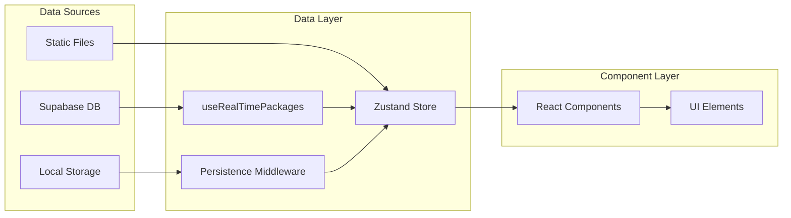

# Architettura Tecnica del Configuratore

## Design Patterns e Principi Architetturali

### 1. Pattern Compositivo (Composition Pattern)
Il configuratore utilizza un pattern compositivo per gestire i diversi step:

```typescript
// ConfiguratorWrapper.tsx - Container principale
const steps = [
  { id: 0, title: "Pacchetto", component: PackageSelector, icon: Package },
  { id: 1, title: "Servizi", component: ServiceConfigurator, icon: Settings },
  { id: 2, title: "Dati Cliente", component: ClientDataForm, icon: User },
  { id: 3, title: "Riepilogo", component: QuoteRecap, icon: FileText },
]

// Rendering dinamico del componente corrente
const CurrentStep = steps[step].component
return <CurrentStep />
```

### 2. State Management con Zustand
Architettura basata su store centralizzato con pattern immer-like:

```typescript
// Pattern per aggiornamenti immutabili
toggleService: (service) =>
  set((state) => {
    const exists = state.selectedServices.find((s) => s.id === service.id)
    if (exists) {
      return {
        selectedServices: state.selectedServices.filter((s) => s.id !== service.id),
      }
    }
    return {
      selectedServices: [...state.selectedServices, service],
    }
  })
```

### 3. Estrategia di Resilienza (Resilience Strategy)
Sistema multi-layer per garantire funzionalità anche in caso di problemi:

```typescript
// Esempio da configurator-store.ts
try {
  const { data: dbServices, error } = await supabase
    .from("services")
    .select("*")
    .eq("package_id", packageId)
    
  if (error) {
    // Layer 2: Fallback a dati statici
    if (error.message.includes("relation") && error.message.includes("does not exist")) {
      console.warn("Services table does not exist, using static package data")
      // Usa dati statici da packages.ts
    }
  }
} catch (error) {
  // Layer 3: Fallback finale con dati di default
  console.error("Error populating package services:", error)
  // Carica servizi di fallback
}
```

## Gestione dei Dati

### 1. Tipologie di Dati

#### Dati Statici (Static Data)
```typescript
// data/services-data.ts
export const serviceOptions: Record<ServiceCategory, ServiceOption[]> = {
  website: [
    {
      id: "website-single",
      name: "Sito Monopagina",
      description: "Sito web con tutte le informazioni in un'unica pagina",
      priceOneTime: 1000,
      category: "website",
      group: "tipo-sito",
    }
  ]
}
```

#### Dati Dinamici (Database)
```sql
-- Struttura tabelle Supabase
CREATE TABLE packages (
  id TEXT PRIMARY KEY,
  nome TEXT NOT NULL,
  descrizione TEXT,
  prezzo DECIMAL(10,2),
  border_color TEXT,
  features JSONB
);

CREATE TABLE services (
  id UUID PRIMARY KEY DEFAULT gen_random_uuid(),
  package_id TEXT REFERENCES packages(id),
  name TEXT NOT NULL,
  description TEXT,
  price DECIMAL(10,2),
  cycle TEXT CHECK (cycle IN ('monthly', 'one-off', 'annual'))
);
```

### 2. Data Flow Architecture



## Sistema di Prezzi Avanzato

### 1. Logica di Calcolo Multi-dimensionale

```typescript
// Calcolo prezzi con gestione di:
// - Prezzi base (one-time vs monthly)
// - Incrementi percentuali
// - Sconti condizionali
// - VAT opzionale
// - Piani di pagamento

class PriceCalculator {
  calculateServicePrice(service: ServiceOption, context: CalculationContext) {
    let basePrice = service.priceOneTime || service.priceMonthly || 0
    
    // Applica incrementi percentuali (es. drone +35%)
    if (service.percentageIncrease) {
      basePrice *= (1 + service.percentageIncrease / 100)
    }
    
    // Applica sconti specifici (es. portfolio -50%)
    if (service.discountPercentage) {
      basePrice *= (1 - service.discountPercentage / 100)
    }
    
    return basePrice
  }
  
  calculateTotalWithDiscounts(services: ServiceOption[], paymentPlan: string) {
    const monthlyTotal = services
      .filter(s => s.priceMonthly)
      .reduce((sum, s) => sum + this.calculateServicePrice(s, context), 0)
    
    const oneTimeTotal = services
      .filter(s => s.priceOneTime)
      .reduce((sum, s) => sum + this.calculateServicePrice(s, context), 0)
    
    // Sconto annuale su servizi di comunicazione
    if (paymentPlan === "annual") {
      const communicationServices = services.filter(s => s.category === "communication")
      const communicationTotal = communicationServices.reduce(
        (sum, service) => sum + (service.priceMonthly || 0), 0
      )
      const annualDiscount = communicationTotal * 0.1
      
      return {
        monthly: monthlyTotal - (communicationTotal * 0.1),
        oneTime: oneTimeTotal,
        annualSavings: annualDiscount * 12
      }
    }
    
    return { monthly: monthlyTotal, oneTime: oneTimeTotal, annualSavings: 0 }
  }
}
```

### 2. Sistema Gradi Piano Comunicazione

```typescript
// Algoritmo avanzato per calcolo gradi personalizzati
interface PlanConfiguration {
  platforms: string[]
  posts: number
  stories: number
  contentType: 'graphics' | 'photos' | 'mix'
}

class CommunicationPlanCalculator {
  private readonly WEIGHTS = {
    PLATFORM_MAX: 120,
    POST_MAX: 120,
    STORIES_MAX: 60,
    CONTENT_MAX: 60
  }
  
  private readonly CONTENT_WEIGHTS = {
    graphics: 20,
    photos: 40,
    mix: 60
  }
  
  calculateDegree(config: PlanConfiguration): number {
    // Contributo piattaforme (normalizzato su 3 piattaforme max)
    const platformContribution = Math.min(config.platforms.length / 3, 1) * this.WEIGHTS.PLATFORM_MAX
    
    // Contributo post (normalizzato su 8 post max)
    const postContribution = Math.min(config.posts / 8, 1) * this.WEIGHTS.POST_MAX
    
    // Contributo stories (normalizzato su 8 stories max)
    const storiesContribution = Math.min(config.stories / 8, 1) * this.WEIGHTS.STORIES_MAX
    
    // Contributo tipo contenuto
    const contentContribution = this.CONTENT_WEIGHTS[config.contentType]
    
    // Somma totale
    const totalDegree = platformContribution + postContribution + storiesContribution + contentContribution
    
    // Arrotonda al multiplo di 5° più vicino e limita a 360°
    return Math.min(360, Math.round(totalDegree / 5) * 5)
  }
  
  calculatePrice(degree: number): number {
    const BASE_PRICE = 300 // Piano 90°
    const PRICE_PER_DEGREE = 250 / 90 // €250 per ogni 90° aggiuntivi
    
    if (degree <= 90) return BASE_PRICE
    
    const additionalDegrees = degree - 90
    return BASE_PRICE + (additionalDegrees * PRICE_PER_DEGREE)
  }
}
```

## Performance e Ottimizzazioni

### 1. Lazy Loading e Code Splitting

```typescript
// Lazy loading dei componenti step
const PackageSelector = lazy(() => import('./steps/package-selector'))
const ServiceConfigurator = lazy(() => import('./steps/service-configurator'))
const ClientDataForm = lazy(() => import('./steps/client-data-form'))
const QuoteRecap = lazy(() => import('./steps/quote-recap'))

// Wrapper con Suspense
function StepWrapper({ step }: { step: number }) {
  return (
    <Suspense fallback={<StepSkeleton />}>
      {step === 0 && <PackageSelector />}
      {step === 1 && <ServiceConfigurator />}
      {step === 2 && <ClientDataForm />}
      {step === 3 && <QuoteRecap />}
    </Suspense>
  )
}
```

### 2. Memoization Strategy

```typescript
// Memoizzazione calcoli pesanti
const PriceSummary = memo(({ services, paymentPlan, showVat }) => {
  const totals = useMemo(() => {
    return calculatePrices(services, paymentPlan)
  }, [services, paymentPlan])
  
  const vatAmount = useMemo(() => {
    return showVat ? totals.total * 0.22 : 0
  }, [totals.total, showVat])
  
  return (
    <div>
      {/* Rendering ottimizzato */}
    </div>
  )
})
```

### 3. Gestione Stato Ottimizzata

```typescript
// Prevenzione re-render inutili nello store
toggleService: (service) =>
  set((state) => {
    const exists = state.selectedServices.find((s) => s.id === service.id)
    if (exists && exists.price === service.price) {
      return state // Stesso stato = no re-render
    }
    // ... logica di aggiornamento
  })
```

## Sicurezza e Validazione

### 1. Validazione Input

```typescript
// Schema Zod per validazione client data
const clientDataSchema = z.object({
  company: z.string().min(2, "Nome azienda richiesto"),
  name: z.string().min(2, "Nome contatto richiesto"),  
  email: z.string().email("Email non valida"),
  phone: z.string().regex(/^[\+]?[0-9\s\-\(\)]+$/, "Telefono non valido"),
  notes: z.string().optional()
})

// Validazione nei componenti
const handleSubmit = (data: FormData) => {
  const result = clientDataSchema.safeParse(data)
  if (!result.success) {
    setErrors(result.error.formErrors.fieldErrors)
    return
  }
  // Procedi con dati validati
}
```

### 2. Sanitizzazione Dati

```typescript
// Sanitizzazione before storing
const sanitizeClientData = (data: ClientData): ClientData => ({
  company: DOMPurify.sanitize(data.company),
  name: DOMPurify.sanitize(data.name),
  email: validator.normalizeEmail(data.email) || '',
  phone: data.phone.replace(/[^\d\+\-\(\)\s]/g, ''),
  notes: DOMPurify.sanitize(data.notes)
})
```

## Testing Strategy

### 1. Unit Tests

```typescript
// Test per logica di calcolo prezzi
describe('PriceCalculator', () => {
  it('should calculate monthly price correctly', () => {
    const services = [
      { id: '1', priceMonthly: 100, category: 'website' },
      { id: '2', priceMonthly: 200, category: 'communication' }
    ]
    
    const calculator = new PriceCalculator()
    expect(calculator.getMonthlyPrice(services)).toBe(300)
  })
  
  it('should apply annual discount on communication services', () => {
    const services = [
      { id: '1', priceMonthly: 300, category: 'communication' }
    ]
    
    const result = calculator.calculateTotalWithDiscounts(services, 'annual')
    expect(result.annualSavings).toBe(360) // 10% * 300 * 12
  })
})
```

### 2. Integration Tests

```typescript
// Test per flusso completo configuratore
describe('Configurator Flow', () => {
  it('should complete full configuration flow', async () => {
    render(<ConfiguratorWrapper />)
    
    // Step 1: Select package
    const packageCard = screen.getByText('Pacchetto Base')
    fireEvent.click(packageCard)
    
    // Step 2: Configure services
    const nextButton = screen.getByText('Continua')
    fireEvent.click(nextButton)
    
    // Verifica servizi popolati
    expect(screen.getByText('Hosting Base')).toBeInTheDocument()
    
    // ... resto del flusso
  })
})
```

## Deployment e DevOps

### 1. Build Optimization

```javascript
// next.config.mjs
const nextConfig = {
  experimental: {
    optimizeCss: true,
    scrollRestoration: true,
  },
  compiler: {
    removeConsole: process.env.NODE_ENV === 'production',
  },
  images: {
    formats: ['image/webp', 'image/avif'],
  },
  webpack: (config, { isServer }) => {
    // Ottimizzazioni bundle
    if (!isServer) {
      config.resolve.fallback.fs = false
    }
    return config
  }
}
```

### 2. Environment Configuration

```typescript
// Configurazione ambiente
const config = {
  supabase: {
    url: process.env.NEXT_PUBLIC_SUPABASE_URL!,
    anonKey: process.env.NEXT_PUBLIC_SUPABASE_ANON_KEY!,
  },
  app: {
    environment: process.env.NODE_ENV,
    version: process.env.NEXT_PUBLIC_APP_VERSION || '1.0.0',
    enableDebug: process.env.NODE_ENV === 'development',
  }
}
```

## Monitoring e Analytics

### 1. Error Tracking

```typescript
// Error boundary per cattura errori
class ConfiguratorErrorBoundary extends Component {
  componentDidCatch(error: Error, errorInfo: ErrorInfo) {
    // Log a servizio di monitoraggio
    console.error('Configurator Error:', error, errorInfo)
    
    // Invio a servizio di tracking (es. Sentry)
    if (typeof window !== 'undefined') {
      // Track error
    }
  }
}
```

### 2. Performance Monitoring

```typescript
// Metriche performance
const trackStepCompletion = (step: number, duration: number) => {
  if (typeof window !== 'undefined' && window.gtag) {
    window.gtag('event', 'step_completed', {
      step_number: step,
      duration_ms: duration,
      event_category: 'configurator'
    })
  }
}
```

---

*Questa architettura tecnica fornisce le basi per un sistema scalabile, performante e manutenibile.*